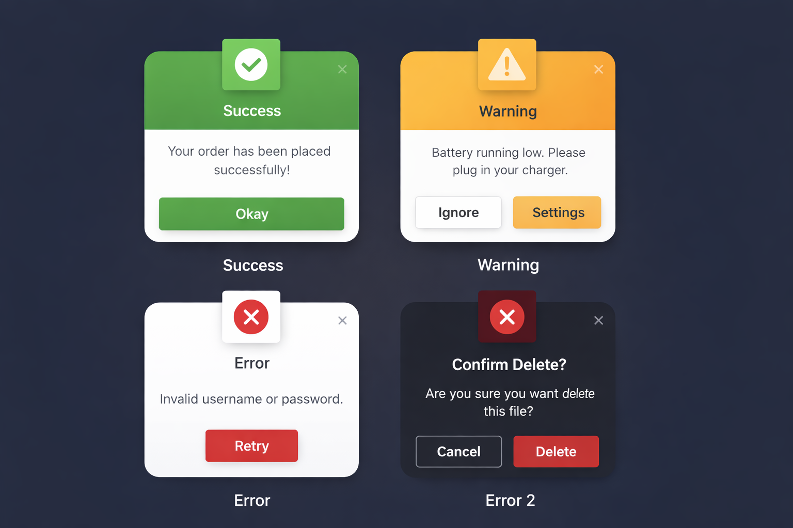

## Custom Dialog Library for Android (Kotlin)
[](https://kotlinlang.org/)
[](LICENSE)
[](#)

A modern, customizable **Error / Success / Warning Dialog Library** for Android built with Kotlin and Material Design.

This library provides clean, reusable dialogs with:

✅ Builder Pattern API  
✅ Success / Warning / Error Types  
✅ Custom Icons  
✅ Custom Button Colors  
✅ Two Button Support (Confirm Dialogs)  
✅ Custom Background Colors  
✅ Modern Material UI  

---

### Preview

Here are some example dialogs created using this library:



---

### Features

-  Beautiful Material Dialog UI  
-  Dialog Types:
    - Success Dialog  
    - Warning Dialog  
    - Error Dialog  
-  Builder Pattern (Professional API)
-  Custom Icon Support  
-  Custom Button Text + Colors  
-  Two Button Dialogs (Yes/No, Retry/Cancel)  
-  Custom Card Background Color  
-  Fully Reusable as a Library Module  

---

## Installation (JitPack)

### 1️⃣ Add JitPack to your **root `settings.gradle` or `build.gradle`**

```gradle
dependencyResolutionManagement {
    repositories {
        google()
        mavenCentral()
        maven { url 'https://jitpack.io' }
    }
}
```
### Add Dependency
```
	dependencies {
	        implementation 'com.github.Excelsior-Technologies-Community:Android_CustomErrorDialog:Tag'
	}
```

---

### Usage

Basic Error Dialog
```kotlin
CustomDialog.Builder(this)
    .setType(DialogType.ERROR)
    .setTitle("Login Failed")
    .setMessage("Invalid username or password")
    .setPositiveButton("Retry")
    .show()
```

Success Dialog
```kotlin
CustomDialog.Builder(this)
    .setType(DialogType.ERROR)
    .setTitle("Login Failed")
    .setMessage("Invalid username or password")
    .setPositiveButton("Retry")
    .show()
```

Warning Dialog
```kotlin
CustomDialog.Builder(this)
    .setType(DialogType.WARNING)
    .setTitle("Warning!")
    .setMessage("Battery running low")
    .setPositiveButton("Okay")
    .show()
```

Two Button Confirmation Dialog
```kotlin
CustomDialog.Builder(this)
    .setType(DialogType.WARNING)
    .setTitle("Delete File?")
    .setMessage("This action cannot be undone!")
    .setPositiveButton("Delete") {
        // Positive action
    }
    .setNegativeButton("Cancel") {
        // Cancel action
    }
    .show()
```

---

### Customization Options

Custom Icon
```kotlin
CustomDialog.Builder(this)
    .setType(DialogType.SUCCESS)
    .setTitle("Uploaded!")
    .setMessage("File uploaded successfully")
    .setIcon(R.drawable.ic_done)
    .setPositiveButton("Great")
    .show()
```

Custom Button Colors
```kotlin
CustomDialog.Builder(this)
    .setType(DialogType.ERROR)
    .setTitle("Failed")
    .setMessage("Something went wrong")
    .setPositiveButton("Retry", R.color.red)
    .setNegativeButton("Cancel", R.color.gray)
    .show()
```

Custom Dialog Background Color
```kotlin
CustomDialog.Builder(this)
    .setType(DialogType.SUCCESS)
    .setTitle("Welcome!")
    .setMessage("Account created successfully")
    .setDialogBackgroundColor(R.color.white)
    .setPositiveButton("Continue")
    .show()
```

Make Dialog Cancelable
```kotlin
CustomDialog.Builder(this)
    .setTitle("Info")
    .setMessage("Tap outside to dismiss")
    .setCancelable(true)
    .setPositiveButton("Okay")
    .show()
```

---

### Attributes

| Method | Description |
|--------|------------|
| `setType(DialogType)` | Set dialog type: **SUCCESS**, **WARNING**, or **ERROR** |
| `setTitle(String)` | Set dialog title text |
| `setMessage(String)` | Set dialog message text |
| `setIcon(@DrawableRes Int)` | Provide a custom icon for the dialog |
| `setPositiveButton(String, Color?, Callback?)` | Set positive button text, optional color, and click listener |
| `setNegativeButton(String, Color?, Callback?)` | Set negative button text, optional color, and click listener |
| `setDialogBackgroundColor(@ColorRes Int)` | Customize the background color of the dialog card |
| `setCancelable(Boolean)` | Allow dialog dismiss when tapping outside |
| `build()` | Builds the dialog instance without showing it |
| `show()` | Builds and displays the dialog instantly |

---

### License

```
MIT License

Copyright (c) 2025 Excelsior Technologies 

Permission is hereby granted, free of charge, to any person obtaining a copy
of this software and associated documentation files (the "Software"), to deal
in the Software without restriction, including without limitation the rights
to use, copy, modify, merge, publish, distribute, sublicense, and/or sell
copies of the Software, and to permit persons to whom the Software is
furnished to do so, subject to the following conditions:

The above copyright notice and this permission notice shall be included in all
copies or substantial portions of the Software.

THE SOFTWARE IS PROVIDED "AS IS", WITHOUT WARRANTY OF ANY KIND, EXPRESS OR
IMPLIED, INCLUDING BUT NOT LIMITED TO THE WARRANTIES OF MERCHANTABILITY,
FITNESS FOR A PARTICULAR PURPOSE AND NONINFRINGEMENT. IN NO EVENT SHALL THE
AUTHORS OR COPYRIGHT HOLDERS BE LIABLE FOR ANY CLAIM, DAMAGES OR OTHER
LIABILITY, WHETHER IN AN ACTION OF CONTRACT, TORT OR OTHERWISE, ARISING FROM,
OUT OF OR IN CONNECTION WITH THE SOFTWARE OR THE USE OR OTHER DEALINGS IN THE
SOFTWARE.
```

